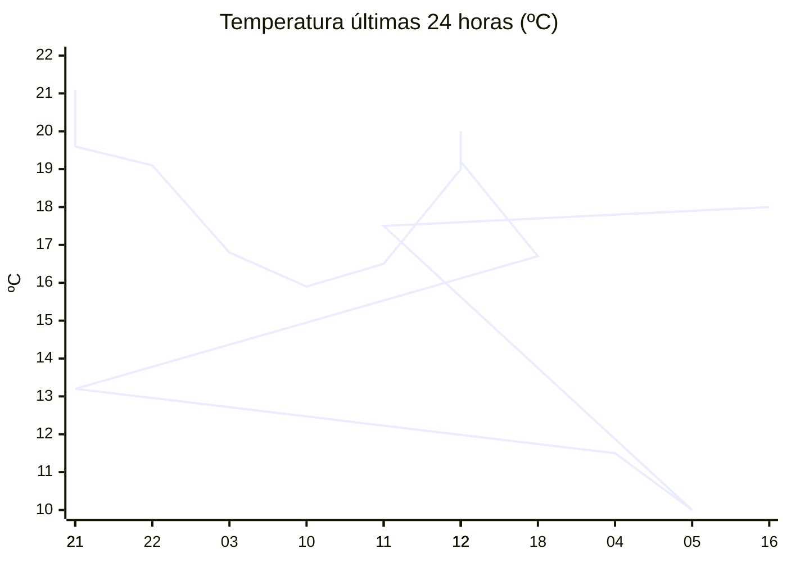

# rem-scrap

Actualización automática del clima para la estación Concarán.

## Últimos datos

| Campo | Valor |
| --- | --- |
| Estación | Concarán |
| Hora | 16:46 |
| Temperatura | 18,0 ºC |
| Humedad | 51,0 % |
| Lluvia (1h) | 0,0 mm |
| Lluvia (24h) | 0,0 mm |
| Lluvia (30d) | 33,0 mm |
| Lluvia (Año) | 517,6 mm |
| Rad. Solar | 498,0 W/m2 |
| Temp Max Hoy | 20 ºC a las 14:20 |
| Temp Min Hoy | 10 ºC a las 05:34 |
| VPS (VPD) | 1.01 kPa (ideal) |

## Resumen IA

Estación Concarán, 16:46 h – tarde fresca y templada, con cielo parcialmente soleado. La temperatura actual es 18,0 ºC, situada entre la máxima de 20 ºC alcanzada a las 14:20 y la mínima de 10 ºC a las 05:34; el rango térmico del día es de 10 ºC y el momento se encuentra 2 ºC por debajo del pico máximo, por lo que se aproxima más al extremo cálido. La humedad relativa está en 51 % y el VPD registra 1,01 kPa, valor calificado como ideal para el desarrollo vegetativo: el aire no está ni demasiado seco ni excesivamente húmedo, favoreciendo una transpiración equilibrada y reduciendo riesgos de estrés hídrico o de hongos. No se registró lluvia en la última hora ni en las últimas 24 h, por lo que la humedad del suelo se mantiene estable. La radiación solar de 498 W/m2 a esta hora indica una intensidad solar moderada‑alta, suficiente para una buena fotosíntesis. Recomiendo mantener el riego programado y vigilar la ventilación para evitar acumulación de humedad en el follaje.

## Tendencia últimas 24 h

## Fuente

Datos extraídos de [clima.sanluis.gob.ar](https://clima.sanluis.gob.ar/Estacion.aspx?estacion=8).

## Generado automáticamente

Este archivo fue actualizado el 8 de octubre de 2026 a las 07:47:06.
