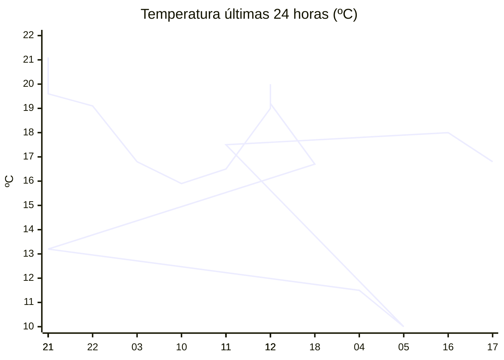

# rem-scrap

Actualización automática del clima para la estación Concarán.

## Últimos datos

| Campo | Valor |
| --- | --- |
| Estación | Concarán |
| Hora | 17:32 |
| Temperatura | 16,8 ºC |
| Humedad | 55,6 % |
| Lluvia (1h) | 0,0 mm |
| Lluvia (24h) | 0,0 mm |
| Lluvia (30d) | 33,0 mm |
| Lluvia (Año) | 517,6 mm |
| Rad. Solar | 131,0 W/m2 |
| Temp Max Hoy | 20 ºC a las 14:20 |
| Temp Min Hoy | 10 ºC a las 05:34 |
| VPS (VPD) | 0.85 kPa (ideal) |

## Resumen IA

Estación Concarán, 17:32 – tarde templada y moderadamente seca.  

Temperatura: el aire está a 16,8 ºC, dentro del rango del día de 10 ºC a 20 ºC (amplitud 10 ºC). La medida actual está a 3,2 ºC del máximo y a 6,8 ºC del mínimo, por lo que se aproxima más al extremo caliente del día.  

Humedad y vapor: la humedad relativa es 55,6 % y el VPD registra 0,85 kPa, valor catalogado como ideal para el crecimiento vegetativo. El déficit de vapor es bajo, lo que indica que la transpiración de las plantas será eficiente sin riesgo de estrés hídrico ni de proliferación de hongos por exceso de humedad.  

Lluvia y radiación: no se registró precipitación en la última hora ni en las últimas 24 h, por lo que la humedad del suelo permanece estable. La radiación solar de 131 W/m2 a esta hora del día refleja una luz moderada, ya que el sol está descendiendo tras el pico de la tarde.  

Recomendación: mantenga un riego ligero y asegure buena ventilación para aprovechar la condición ideal de VPD.

## Tendencia últimas 24 h

## Fuente

Datos extraídos de [clima.sanluis.gob.ar](https://clima.sanluis.gob.ar/Estacion.aspx?estacion=8).

## Generado automáticamente

Este archivo fue actualizado el 8 de octubre de 2026 a las 08:33:05.
