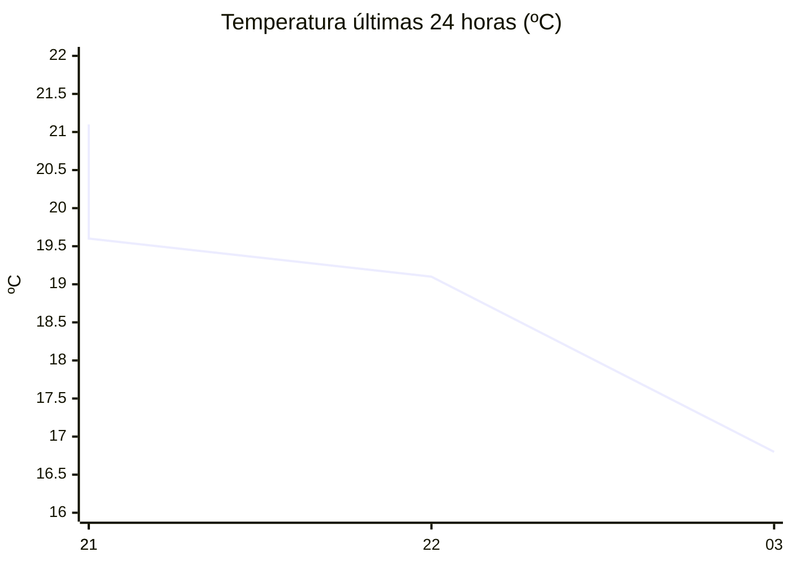

# rem-scrap

Actualización automática del clima para la estación Concarán.

## Últimos datos

| Campo | Valor |
| --- | --- |
| Estación | Concarán |
| Hora | 03:50 |
| Temperatura | 16,8 ºC |
| Humedad | 81,4 % |
| Lluvia (1h) | 0,0 mm |
| Lluvia (24h) | 0,0 mm |
| Lluvia (30d) | 33,0 mm |
| Lluvia (Año) | 517,6 mm |
| Rad. Solar | 0,0 W/m2 |
| Temp Max Hoy | 17 ºC a las 02:47 |
| Temp Min Hoy | 15 ºC a las 00:31 |
| VPS (VPD) | 0.36 kPa (bajo) |

## Resumen IA

Estación Concarán, 03:50 h – noche fresca y bastante húmeda.  
Temperatura actual 16,8 ºC se sitúa apenas 0,2 ºC bajo la máxima del día (17 ºC) y 1,8 ºC sobre la mínima (15 ºC), por lo que el rango térmico del día es de 2 ºC y el clima del momento se aproxima al extremo cálido del día.  
La humedad relativa es 81,4 % y el VPD es 0,36 kPa, valor muy bajo (por debajo de 0,8 kPa). El aire es poco demandante en agua, la transpiración de las plantas será mínima y el riesgo de desarrollo de hongos aumenta por la humedad estancada.  
No se registró lluvia en la última hora ni en las últimas 24 h; la radiación solar es 0 W/m2, típico de la madrugada, por lo que no hay aporte de energía solar.  
Recomendación: mantenga una ventilación ligera y evite riegos nocturnos para reducir la probabilidad de enfermedades fúngicas.

## Tendencia últimas 24 h

## Fuente

Datos extraídos de [clima.sanluis.gob.ar](https://clima.sanluis.gob.ar/Estacion.aspx?estacion=8).

## Generado automáticamente

Este archivo fue actualizado el 7 de octubre de 2026 a las 06:51:27.
