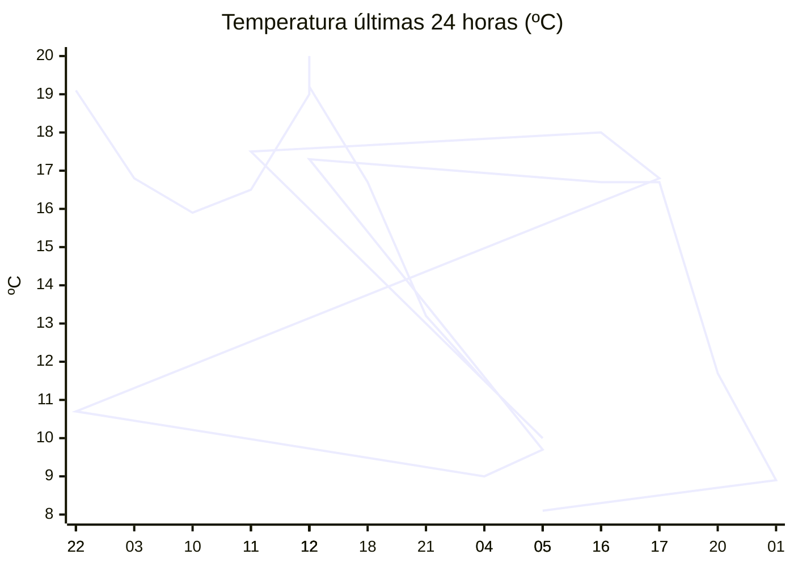

# rem-scrap

Actualización automática del clima para la estación Concarán.

## Últimos datos

| Campo | Valor |
| --- | --- |
| Estación | Concarán |
| Hora | 05:24 |
| Temperatura | 8,1 ºC |
| Humedad | 99,8 % |
| Lluvia (1h) | 3,9 mm |
| Lluvia (24h) | 16,3 mm |
| Lluvia (30d) | 40,2 mm |
| Lluvia (Año) | 533,9 mm |
| Rad. Solar | 0,0 W/m2 |
| Temp Max Hoy | 10 ºC a las 00:23 |
| Temp Min Hoy | 8 ºC a las 04:51 |
| VPS (VPD) | 0 kPa (bajo) |

## Resumen IA

Estación Concarán, 05:24 h – madrugada fresca y extremadamente húmeda después de lluvias intensas.  

Temperatura actual 8,1 ºC se sitúa a solo 0,1 ºC del mínimo del día (8 ºC) y a 1,9 ºC por debajo del máximo (10 ºC). El rango térmico del día es de 2 ºC, por lo que la condición actual está mucho más próxima al extremo frío.  

La humedad relativa es 99,8 %, casi saturación. El VPD reportado es 0 kPa, lo que indica ausencia de déficit de vapor: el aire no impulsa transpiración y favorece la aparición de hongos en cultivos sensibles.  

Lluvia reciente: 3,9 mm en la última hora y 16,3 mm en las últimas 24 h, lo que eleva la humedad del suelo y del aire. La radiación solar es 0 W/m2, típica de la madrugada antes del amanecer, por lo que no hay aporte solar significativo.  

Recomendación: ventilar los invernaderos o cultivos al abrir cubiertas al amanecer y evitar riegos adicionales hasta que la humedad del aire disminuya.

## Tendencia últimas 24 h

## Fuente

Datos extraídos de [clima.sanluis.gob.ar](https://clima.sanluis.gob.ar/Estacion.aspx?estacion=8).

## Generado automáticamente

Este archivo fue actualizado el 10 de octubre de 2026 a las 08:25:28.
