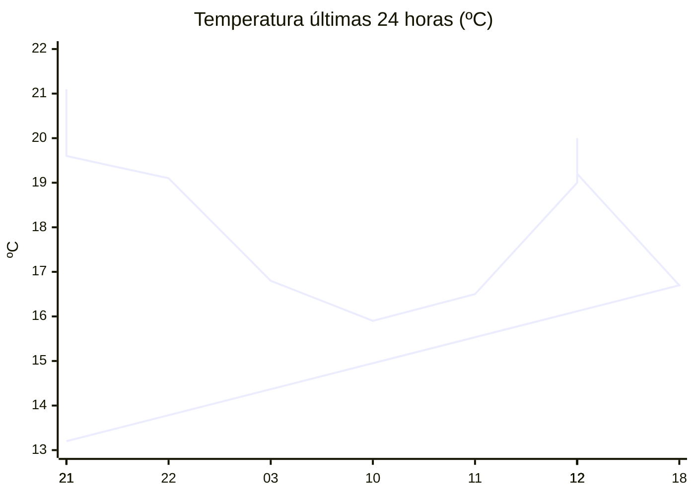

# rem-scrap

Actualización automática del clima para la estación Concarán.

## Últimos datos

| Campo | Valor |
| --- | --- |
| Estación | Concarán |
| Hora | 21:55 |
| Temperatura | 13,2 ºC |
| Humedad | 92,7 % |
| Lluvia (1h) | 0,0 mm |
| Lluvia (24h) | 0,0 mm |
| Lluvia (30d) | 33,0 mm |
| Lluvia (Año) | 517,6 mm |
| Rad. Solar | 0,0 W/m2 |
| Temp Max Hoy | 26 ºC a las 14:54 |
| Temp Min Hoy | 14 ºC a las 20:59 |
| VPS (VPD) | 0.11 kPa (bajo) |

## Resumen IA

Estación Concarán, 21:55 h – la noche se presenta fresca y muy húmeda. La temperatura actual es de 13,2 ºC; el máximo del día alcanzó 26 ºC a las 14:54 y el mínimo 14 ºC a las 20:59, lo que genera un rango térmico de 12 ºC. La medida del momento está 0,8 ºC por debajo del mínimo registrado, por lo que se aproxima al extremo frío del día. La humedad relativa es del 92,7 % y el VPD es 0,11 kPa, un valor muy bajo que indica poco requerimiento de transpiración y favorece la permanencia de humedad en la superficie, aumentando el riesgo de desarrollo de hongos. No se registró lluvia en la última hora ni en las últimas 24 h; la radiación solar es nula, propia de la hora nocturna. Dado el ambiente húmedo y la baja demanda evaporativa, se aconseja ventilar ligeramente el cultivo y, si persiste la humedad, aplicar medidas preventivas contra enfermedades fúngicas.

## Tendencia últimas 24 h

## Fuente

Datos extraídos de [clima.sanluis.gob.ar](https://clima.sanluis.gob.ar/Estacion.aspx?estacion=8).

## Generado automáticamente

Este archivo fue actualizado el 8 de octubre de 2026 a las 12:55:57.
