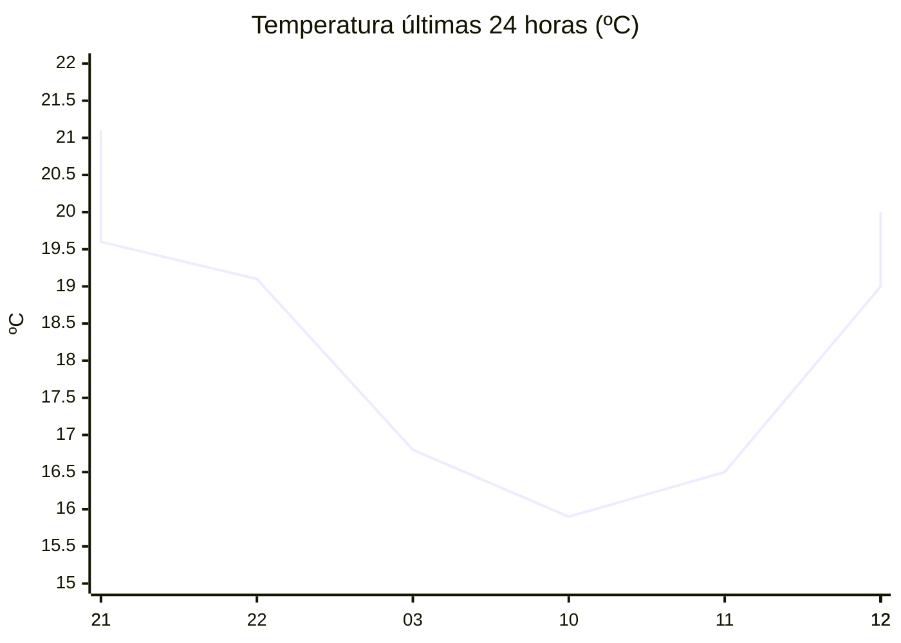

# rem-scrap

Actualización automática del clima para la estación Concarán.

## Últimos datos

| Campo | Valor |
| --- | --- |
| Estación | Concarán |
| Hora | 12:25 |
| Temperatura | 19,2 ºC |
| Humedad | 70,5 % |
| Lluvia (1h) | 0,0 mm |
| Lluvia (24h) | 0,0 mm |
| Lluvia (30d) | 33,0 mm |
| Lluvia (Año) | 517,6 mm |
| Rad. Solar | 218,0 W/m2 |
| Temp Max Hoy | 20 ºC a las 11:56 |
| Temp Min Hoy | 15 ºC a las 00:31 |
| VPS (VPD) | 0.66 kPa (bajo) |

## Resumen IA

Concarán, 12:25, mediodía templado y con humedad marcada. La temperatura actual es 19,2 ºC, a solo 0,8 ºC del máximo de 20 ºC registrado a las 11:56 y 4,2 ºC por encima del mínimo de 15 ºC de la madrugada; el rango térmico del día es de 5 ºC y el aire se sitúa claramente próximo al extremo caliente. La humedad relativa es 70,5 % y el VPD es 0,66 kPa, valor bajo que indica poco requerimiento de transpiración y favorece la aparición de hongos si el follaje permanece húmedo. No se registró lluvia en la última hora ni en las últimas 24 h, por lo que la humedad del suelo no se vio incrementada; la precipitación acumulada en los últimos 30 d es 33 mm y en el año 517,6 mm. La radiación solar de 218 W/m² a medio día señala una intensidad solar moderada‑alta, suficiente para una buena fotosíntesis pero sin riesgos de quemaduras inmediatas. Recomiendo mantener una ventilación ligera y, si el cultivo es sensible a hongos, aplicar un fungicida preventivo.

## Tendencia últimas 24 h

## Fuente

Datos extraídos de [clima.sanluis.gob.ar](https://clima.sanluis.gob.ar/Estacion.aspx?estacion=8).

## Generado automáticamente

Este archivo fue actualizado el 7 de octubre de 2026 a las 03:26:20.
