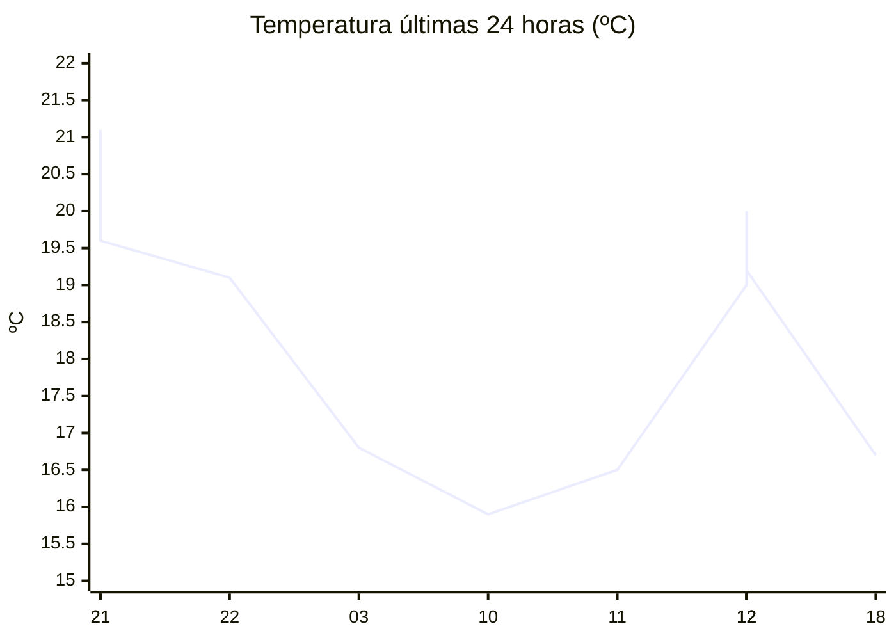

# rem-scrap

Actualización automática del clima para la estación Concarán.

## Últimos datos

| Campo | Valor |
| --- | --- |
| Estación | Concarán |
| Hora | 18:05 |
| Temperatura | 16,7 ºC |
| Humedad | 76,1 % |
| Lluvia (1h) | 0,0 mm |
| Lluvia (24h) | 0,0 mm |
| Lluvia (30d) | 33,0 mm |
| Lluvia (Año) | 517,6 mm |
| Rad. Solar | 167,0 W/m2 |
| Temp Max Hoy | 26 ºC a las 14:54 |
| Temp Min Hoy | 15 ºC a las 00:31 |
| VPS (VPD) | 0.45 kPa (bajo) |

## Resumen IA

Concarán, 18:05, tarde fresca y algo húmeda. La temperatura actual es 16,7 ºC, situada a solo 1,7 ºC por encima de la mínima registrada (15 ºC) y a 9,3 ºC de la máxima (26 ºC). El rango térmico del día es de 11 ºC, por lo que el clima del momento se aproxima al extremo frío. La humedad relativa es 76,1 % y el VPD es 0,45 kPa, valor bajo que indica poca demanda de agua por parte del aire y favorece la proliferación de hongos si el follaje permanece húmedo. No se registró lluvia en la última hora ni en las últimas 24 h; la humedad alta se mantiene por la falta de precipitación reciente, pese a los 33 mm acumulados en los últimos 30 días y 517,6 mm en el año. La radiación solar de 167 W/m2 a esa hora muestra una intensidad moderada, típica de un atardecer parcialmente despejado. Se recomienda vigilar la humedad del follaje y, si es necesario, aplicar ventilación ligera para evitar problemas fúngicos.

## Tendencia últimas 24 h

## Fuente

Datos extraídos de [clima.sanluis.gob.ar](https://clima.sanluis.gob.ar/Estacion.aspx?estacion=8).

## Generado automáticamente

Este archivo fue actualizado el 7 de octubre de 2026 a las 09:06:32.
