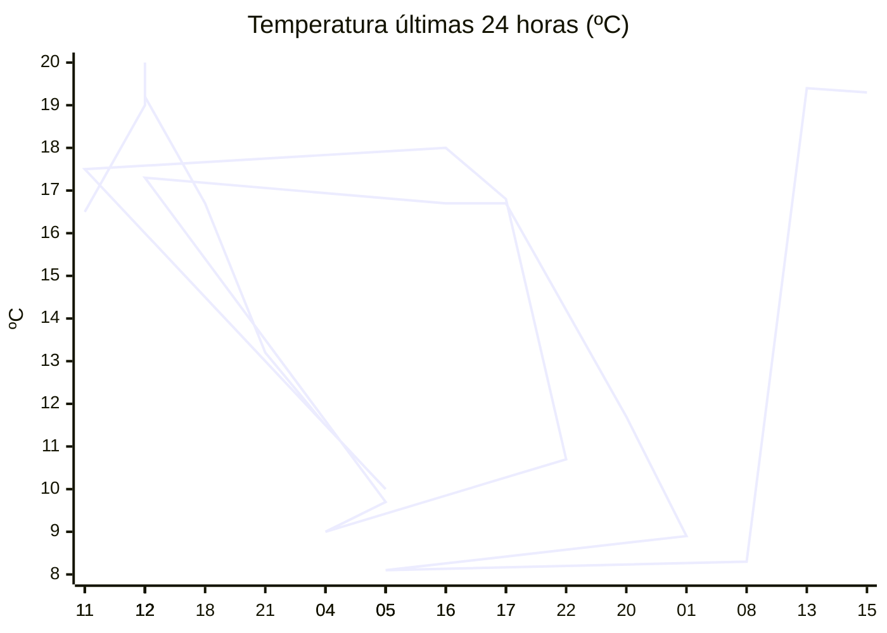

# rem-scrap

Actualización automática del clima para la estación Concarán.

## Últimos datos

| Campo | Valor |
| --- | --- |
| Estación | Concarán |
| Hora | 15:23 |
| Temperatura | 19,3 ºC |
| Humedad | 48,8 % |
| Lluvia (1h) | 0,0 mm |
| Lluvia (24h) | 13,7 mm |
| Lluvia (30d) | 40,5 mm |
| Lluvia (Año) | 534,2 mm |
| Rad. Solar | 283,0 W/m2 |
| Temp Max Hoy | 21 ºC a las 14:51 |
| Temp Min Hoy | 8 ºC a las 06:57 |
| VPS (VPD) | 1.15 kPa (ideal) |

## Resumen IA

Estación Concarán, 15:23 hs: tarde templada y con cielo parcialmente despejado.  

Temperatura actual 19,3 ºC, frente a la máxima de 21 ºC alcanzada a las 14:51 y la mínima de 8 ºC a las 06:57. El rango térmico del día es de 13 ºC; la medida presente está a 1,7 ºC de la máxima y a 11,3 ºC de la mínima, por lo que se aproxima mucho más al extremo caliente del día.  

La humedad relativa es 48,8 % y el VPD se reporta como 1,15 kPa, catalogado como “ideal”. Ese VPD indica que el aire ofrece suficiente gradiente para que las plantas transpiren eficientemente sin riesgo de estrés hídrico ni de proliferación de hongos por exceso de humedad.  

No hubo lluvia en la última hora, pero el total de 13,7 mm en 24 hs muestra precipitación reciente, lo que ayuda a mantener la humedad del suelo. La radiación solar de 283 W/m² a esta hora del día representa una intensidad moderada‑alta, favoreciendo la fotosíntesis.  

Recomendación: mantener riego moderado y asegurar buena ventilación para evitar acumulación de humedad en el follaje.

## Tendencia últimas 24 h

## Fuente

Datos extraídos de [clima.sanluis.gob.ar](https://clima.sanluis.gob.ar/Estacion.aspx?estacion=8).

## Generado automáticamente

Este archivo fue actualizado el 10 de octubre de 2026 a las 06:24:31.
