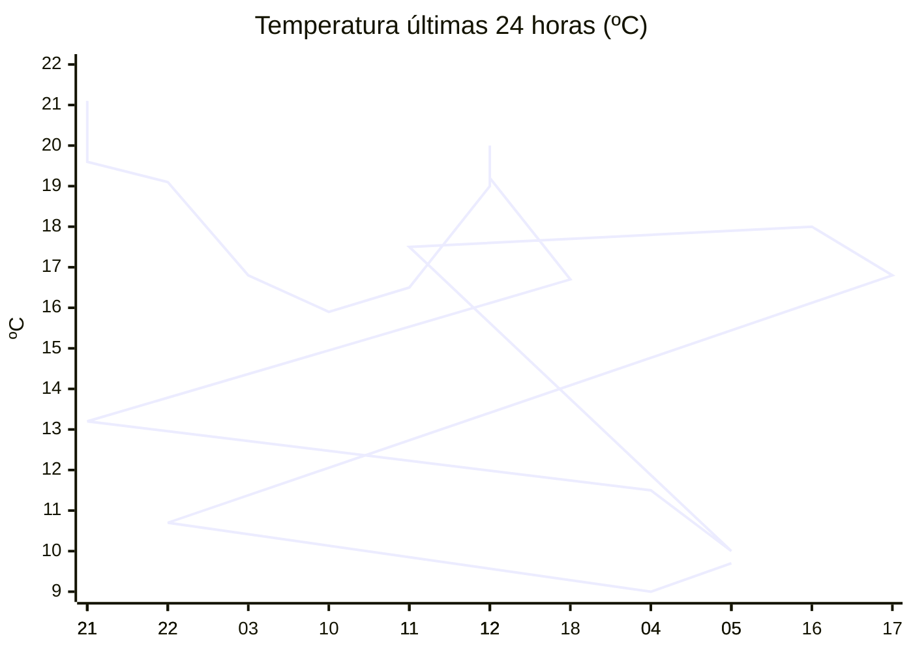

# rem-scrap

Actualización automática del clima para la estación Concarán.

## Últimos datos

| Campo | Valor |
| --- | --- |
| Estación | Concarán |
| Hora | 05:54 |
| Temperatura | 9,7 ºC |
| Humedad | 90,8 % |
| Lluvia (1h) | 0,0 mm |
| Lluvia (24h) | 0,0 mm |
| Lluvia (30d) | 32,6 mm |
| Lluvia (Año) | 517,6 mm |
| Rad. Solar | 0,0 W/m2 |
| Temp Max Hoy | 10 ºC a las 01:25 |
| Temp Min Hoy | 9 ºC a las 04:31 |
| VPS (VPD) | 0.11 kPa (bajo) |

## Resumen IA

Estación Concarán, 05:54 hs: madrugada fresca y muy húmeda, con cielo nublado.  
Temperatura actual 9,7 ºC se sitúa entre la máxima de 10 ºC (01:25) y la mínima de 9 ºC (04:31); el rango térmico del día es de 1 ºC y la lectura está a 0,3 ºC de la máxima, por lo que se aproxima más al extremo cálido.  
Humedad relativa 90,8 % es alta y el VPD de 0,11 kPa está muy por debajo del umbral de 0,8 kPa, lo que indica aire poco demandante, transpiración reducida y mayor riesgo de desarrollo de hongos por humedad estancada.  
No se registró lluvia en la última hora ni en las últimas 24 h; la falta de precipitación reciente mantiene la humedad del suelo estable, pero la radiación solar es 0 W/m2, típica de la hora antes del amanecer, por lo que no hay aporte energético solar.  
Recomendación: ventilar ligeramente el cultivo y evitar riegos nocturnos para reducir la humedad foliar y prevenir enfermedades.

## Tendencia últimas 24 h

## Fuente

Datos extraídos de [clima.sanluis.gob.ar](https://clima.sanluis.gob.ar/Estacion.aspx?estacion=8).

## Generado automáticamente

Este archivo fue actualizado el 9 de octubre de 2026 a las 08:55:31.
