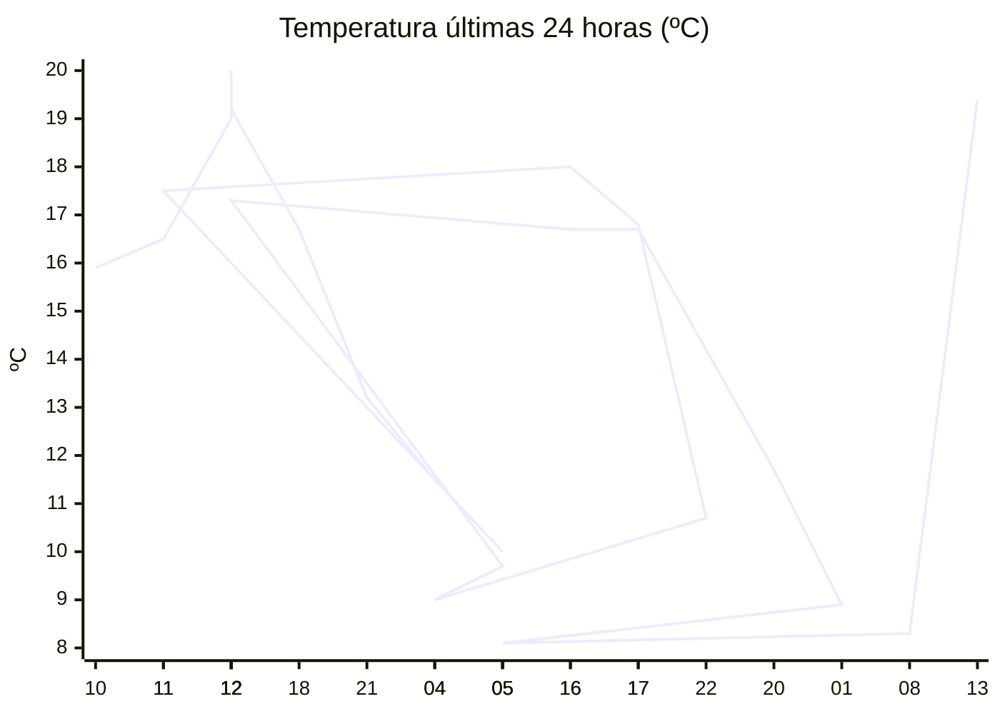

# rem-scrap

Actualización automática del clima para la estación Concarán.

## Últimos datos

| Campo | Valor |
| --- | --- |
| Estación | Concarán |
| Hora | 13:07 |
| Temperatura | 19,4 ºC |
| Humedad | 53,4 % |
| Lluvia (1h) | 0,0 mm |
| Lluvia (24h) | 16,6 mm |
| Lluvia (30d) | 40,5 mm |
| Lluvia (Año) | 534,2 mm |
| Rad. Solar | 878,0 W/m2 |
| Temp Max Hoy | 19 ºC a las 12:44 |
| Temp Min Hoy | 8 ºC a las 06:57 |
| VPS (VPD) | 1.05 kPa (ideal) |

## Resumen IA

Estación Concarán, 13:07 h – jornada de medio día con sol intenso y ambiente templado.  

Temperatura actual 19,4 ºC está ligeramente por encima de la máxima registrada hoy (19 ºC a las 12:44) y muy próxima al extremo cálido; el rango térmico del día fue de 11 ºC (8 ºC mínima a las 06:57).  

La humedad relativa es 53,4 % y el VPD indica 1,05 kPa, valor catalogado como “ideal”. Esto significa que el aire ofrece una demanda hídrica moderada, favoreciendo una transpiración equilibrada y reduciendo el riesgo de enfermedades por exceso de humedad.  

En la última hora no hubo precipitación, pero en las últimas 24 h se acumularon 16,6 mm de lluvia, lo que eleva la humedad del suelo. La radiación solar de 878,0 W/m² a la hora del almuerzo evidencia una luz fuerte y potencial de evaporación.  

Recomendación: mantenga riegos moderados y favorezca una ligera ventilación para evitar sobre‑humectación del follaje.

## Tendencia últimas 24 h

## Fuente

Datos extraídos de [clima.sanluis.gob.ar](https://clima.sanluis.gob.ar/Estacion.aspx?estacion=8).

## Generado automáticamente

Este archivo fue actualizado el 10 de octubre de 2026 a las 04:08:31.
