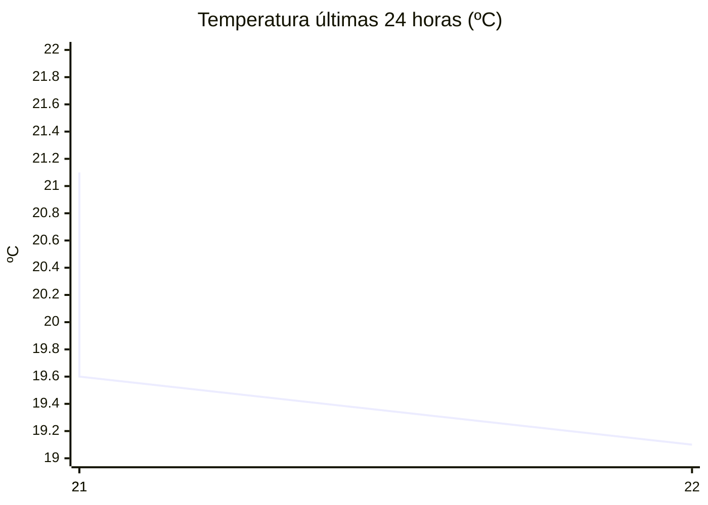

# rem-scrap

Actualización automática del clima para la estación Concarán.

## Últimos datos

| Campo | Valor |
| --- | --- |
| Estación | Concarán |
| Hora | 22:01 |
| Temperatura | 19,1 ºC |
| Humedad | 60,9 % |
| Lluvia (1h) | 0,0 mm |
| Lluvia (24h) | 0,0 mm |
| Lluvia (30d) | 33,0 mm |
| Lluvia (Año) | 517,6 mm |
| Rad. Solar | 0,0 W/m2 |
| Temp Max Hoy | 29 ºC a las 16:38 |
| Temp Min Hoy | 9 ºC a las 06:19 |
| VPS (VPD) | 0.86 kPa (ideal) |

## Resumen IA

Concarán, 22:01 h – noche fresca y moderadamente húmeda.  
Temperatura actual 19,1 ºC, comparada con la máxima de 29 ºC a las 16:38 y la mínima de 9 ºC a las 06:19. El rango térmico del día es de 20 ºC; la temperatura de ahora está a 9,9 ºC de la máxima y a 10,1 ºC de la mínima, por lo que se sitúa ligeramente más cerca del extremo máximo.  
Humedad relativa 60,9 % y VPD (vps) 0,86 kPa, valor catalogado como “ideal”. Ese VPD indica que el aire ofrece una demanda de vapor moderada: la transpiración de los cultivos será eficiente y el riesgo de desarrollo de hongos por humedad estancada es bajo.  
No se registró lluvia en la última hora ni en las últimas 24 h, y la radiación solar está en 0,0 W/m2, típica de la noche; la humedad del aire se mantiene sin aporte reciente de agua.  
Mantenga una ventilación ligera durante la noche y evite riegos intensos ahora, ya que la humedad del ambiente es suficiente para el cultivo.

## Tendencia últimas 24 h

## Fuente

Datos extraídos de [clima.sanluis.gob.ar](https://clima.sanluis.gob.ar/Estacion.aspx?estacion=8).

## Generado automáticamente

Este archivo fue actualizado el 7 de octubre de 2026 a las 01:02:22.
