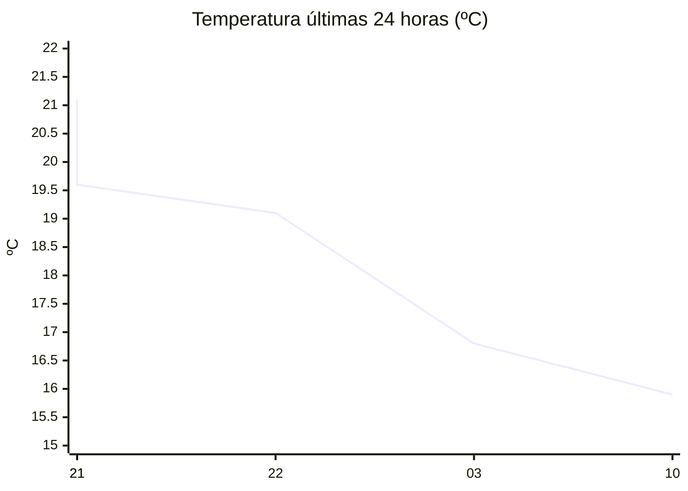

# rem-scrap

Actualización automática del clima para la estación Concarán.

## Últimos datos

| Campo | Valor |
| --- | --- |
| Estación | Concarán |
| Hora | 10:48 |
| Temperatura | 15,9 ºC |
| Humedad | 87,3 % |
| Lluvia (1h) | 0,0 mm |
| Lluvia (24h) | 0,0 mm |
| Lluvia (30d) | 33,0 mm |
| Lluvia (Año) | 517,6 mm |
| Rad. Solar | 96,0 W/m2 |
| Temp Max Hoy | 17 ºC a las 02:47 |
| Temp Min Hoy | 15 ºC a las 00:31 |
| VPS (VPD) | 0.23 kPa (bajo) |

## Resumen IA

Estación Concarán, 10:48 h – mañana fresca y bastante húmeda. La temperatura actual es 15,9 ºC, dentro del rango del día (15 ºC – 17 ºC). El rango térmico es de 2 ºC; el valor medido está 0,9 ºC por encima del mínimo y 1,1 ºC por debajo del máximo, por lo que se aproxima más al extremo frío. La humedad relativa se sitúa en 87,3 % y el VPD es 0,23 kPa, muy bajo (<0,8 kPa). Esto indica aire poco demandante, con transpiración reducida y riesgo de desarrollo de hongos por la humedad estancada, condición que favorece la proliferación de patógenos foliares. No hubo lluvia en la última hora ni en las últimas 24 h; la precipitación acumulada del mes (33 mm) y del año (517,6 mm) muestra un balance húmedo moderado. La radiación solar de 96 W/m2 a esta hora del día representa una intensidad solar moderada, suficiente para un leve calentamiento sin riesgo de quemaduras. Recomiendo mantener una buena ventilación y, si el cultivo es sensible a hongos, aplicar fungicidas preventivos y evitar riegos nocturnos.

## Tendencia últimas 24 h

## Fuente

Datos extraídos de [clima.sanluis.gob.ar](https://clima.sanluis.gob.ar/Estacion.aspx?estacion=8).

## Generado automáticamente

Este archivo fue actualizado el 7 de octubre de 2026 a las 01:49:23.
