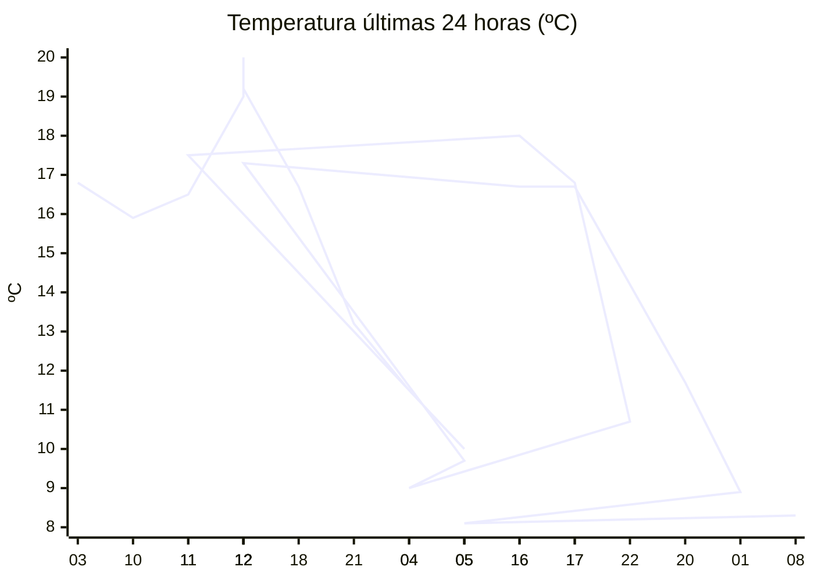

# rem-scrap

Actualización automática del clima para la estación Concarán.

## Últimos datos

| Campo | Valor |
| --- | --- |
| Estación | Concarán |
| Hora | 07:59 |
| Temperatura | 8,3 ºC |
| Humedad | 99,8 % |
| Lluvia (1h) | 0,0 mm |
| Lluvia (24h) | 16,6 mm |
| Lluvia (30d) | 40,5 mm |
| Lluvia (Año) | 534,2 mm |
| Rad. Solar | 85,0 W/m2 |
| Temp Max Hoy | 10 ºC a las 00:23 |
| Temp Min Hoy | 8 ºC a las 06:57 |
| VPS (VPD) | 0 kPa (bajo) |

## Resumen IA

Estación Concarán, 07:59 hs: mañana fresca y extremadamente húmeda, con cielo parcialmente nublado.  

Temperatura actual 8,3 ºC se sitúa entre la mínima de 8 ºC (06:57) y la máxima de 10 ºC (00:23). El rango térmico del día es de 2 ºC; el valor medido está 0,3 ºC por encima del mínimo y 1,7 ºC bajo la máxima, por lo que se acerca más al extremo frío.  

Humedad relativa 99,8 % y VPD 0 kPa indican aire prácticamente saturado. Un VPD nulo implica transpiración mínima y alto riesgo de desarrollo de hongos, por lo que el ambiente es poco demandante para la evaporación pero potencialmente problemático para cultivos sensibles a la humedad.  

Lluvia en la última hora 0,0 mm, pero 16,6 mm en las últimas 24 h, lo que mantiene la humedad del suelo y del aire elevada. La radiación solar de 85 W/m2 a esta hora sugiere luz tenue, típico del inicio de la mañana.  

Recomendación: ventilar los cultivos o aplicar medidas preventivas contra hongos y abstenerse de riegos adicionales hasta que disminuya la humedad del aire.

## Tendencia últimas 24 h

## Fuente

Datos extraídos de [clima.sanluis.gob.ar](https://clima.sanluis.gob.ar/Estacion.aspx?estacion=8).

## Generado automáticamente

Este archivo fue actualizado el 10 de octubre de 2026 a las 11:00:43.
