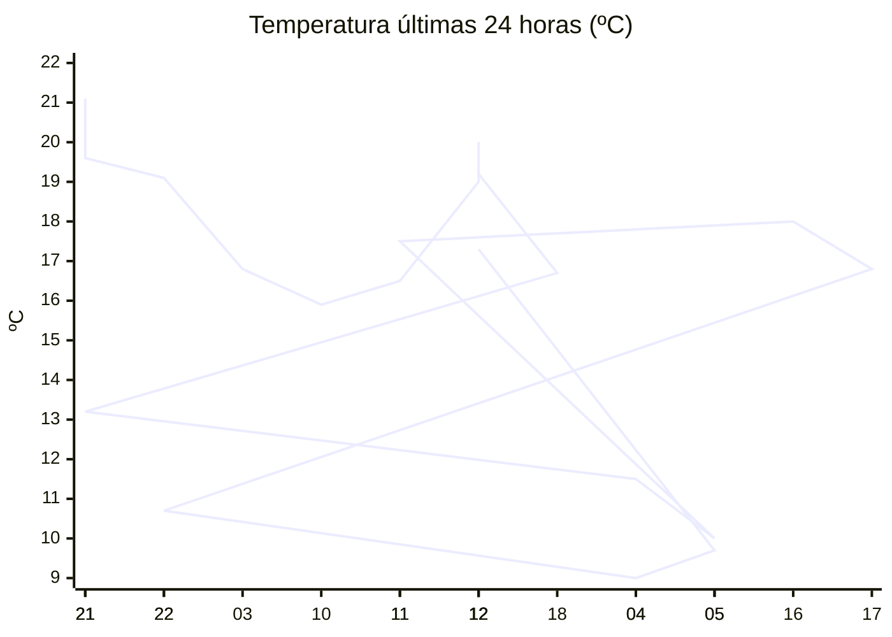

# rem-scrap

Actualización automática del clima para la estación Concarán.

## Últimos datos

| Campo | Valor |
| --- | --- |
| Estación | Concarán |
| Hora | 12:02 |
| Temperatura | 17,3 ºC |
| Humedad | 53,8 % |
| Lluvia (1h) | 0,0 mm |
| Lluvia (24h) | 0,0 mm |
| Lluvia (30d) | 32,6 mm |
| Lluvia (Año) | 517,6 mm |
| Rad. Solar | 220,0 W/m2 |
| Temp Max Hoy | 18 ºC a las 11:51 |
| Temp Min Hoy | 9 ºC a las 04:31 |
| VPS (VPD) | 0.91 kPa (ideal) |

## Resumen IA

Estación Concarán, 12:02 h – se registra una tarde templada y estable, sin lluvia reciente y con sol moderado.  
Temperatura actual 17,3 ºC está a solo 0,7 ºC de la máxima de hoy (18 ºC) y a 8,3 ºC de la mínima (9 ºC), lo que indica que el día está casi en su punto álgido; el rango térmico del día es de 9 ºC y la temperatura del momento se acerca más al extremo máximo.  
La humedad relativa es 53,8 % y el VPD indica 0,91 kPa, valor calificado como “ideal”. Eso significa que el aire ofrece una demanda hídrica equilibrada para los cultivos: la transpiración es eficiente y el riesgo de enfermedades por exceso de humedad es bajo.  
No hubo precipitación en la última hora ni en las últimas 24 h; la lluvia acumulada en los últimos 30 d es 32,6 mm y en el año 517,6 mm. La radiación solar de 220,0 W/m2 a mediodía sugiere una irradiancia suficiente para el crecimiento vegetativo sin sobrecalentamiento.  
Recomendación: mantener riego ligero y ventilación moderada; no es necesario aplicar protección contra heladas ni sombra adicional.

## Tendencia últimas 24 h

## Fuente

Datos extraídos de [clima.sanluis.gob.ar](https://clima.sanluis.gob.ar/Estacion.aspx?estacion=8).

## Generado automáticamente

Este archivo fue actualizado el 9 de octubre de 2026 a las 03:03:25.
