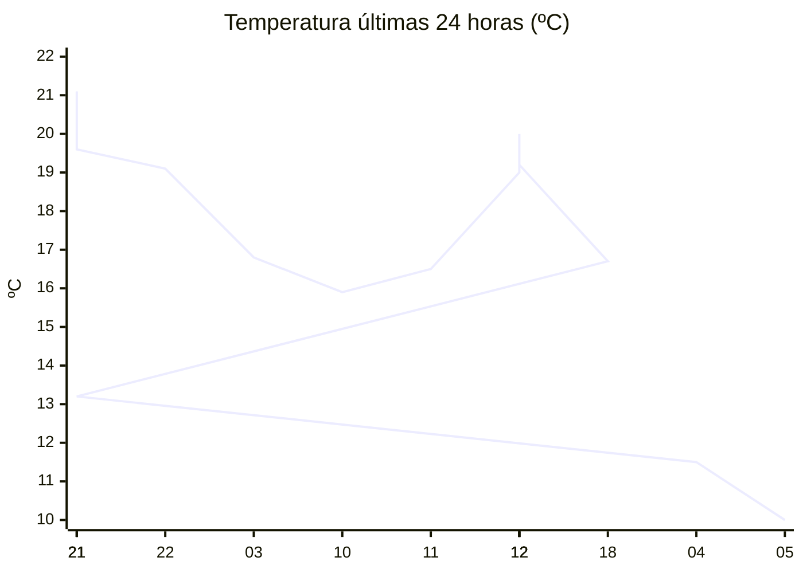

# rem-scrap

Actualización automática del clima para la estación Concarán.

## Últimos datos

| Campo | Valor |
| --- | --- |
| Estación | Concarán |
| Hora | 05:50 |
| Temperatura | 10,0 ºC |
| Humedad | 91,3 % |
| Lluvia (1h) | 0,0 mm |
| Lluvia (24h) | 0,0 mm |
| Lluvia (30d) | 33,0 mm |
| Lluvia (Año) | 517,6 mm |
| Rad. Solar | 0,0 W/m2 |
| Temp Max Hoy | 13 ºC a las 00:02 |
| Temp Min Hoy | 10 ºC a las 04:59 |
| VPS (VPD) | 0.11 kPa (bajo) |

## Resumen IA

Estación Concarán – 05:50 h. La madrugada se presenta fresca y muy húmeda, con poca luz solar.

Temperatura: la medida actual es 10 ºC, idéntica a la mínima del día (10 ºC a 04:59) y por debajo del máximo de 13 ºC alcanzado a 00:02. El rango térmico del día es de 3 ºC; la temperatura del momento se sitúa en el extremo más bajo, acercándose a la mínima.

Humedad y vapor: la humedad relativa está en 91,3 % y el VPD es de 0,11 kPa, muy por debajo del umbral de 0,8 kPa. Eso indica un aire poco demandante, con transpiración reducida y riesgo de desarrollo de hongos por la humedad estancada; las plantas perciben poca necesidad de abrir estomas.

Lluvia y radiación: no se registró precipitación en la última hora ni en las últimas 24 h; la radiación solar es 0 W/m2, típica de la madrugada, por lo que la humedad se mantiene alta sin efecto de secado solar.

Recomendación: ventile ligeramente el cultivo y posponga el riego hasta que aumente la temperatura y la radiación, evitando problemas de hongos.

## Tendencia últimas 24 h

## Fuente

Datos extraídos de [clima.sanluis.gob.ar](https://clima.sanluis.gob.ar/Estacion.aspx?estacion=8).

## Generado automáticamente

Este archivo fue actualizado el 8 de octubre de 2026 a las 08:51:45.
