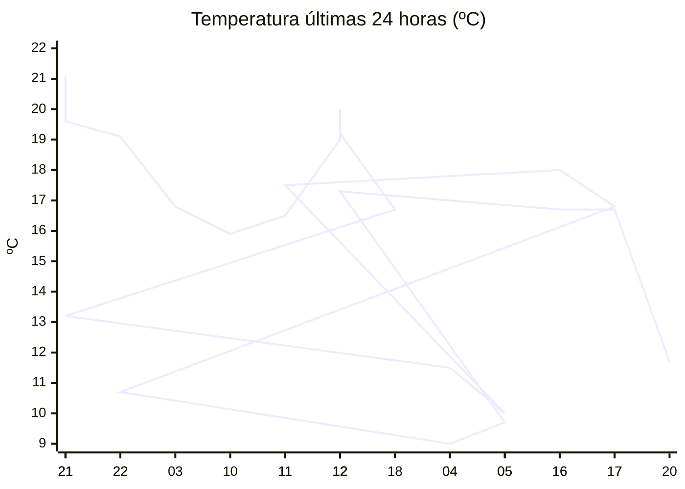

# rem-scrap

Actualización automática del clima para la estación Concarán.

## Últimos datos

| Campo | Valor |
| --- | --- |
| Estación | Concarán |
| Hora | 20:57 |
| Temperatura | 11,7 ºC |
| Humedad | 81,3 % |
| Lluvia (1h) | 0,0 mm |
| Lluvia (24h) | 12,0 mm |
| Lluvia (30d) | 44,6 mm |
| Lluvia (Año) | 529,6 mm |
| Rad. Solar | 0,0 W/m2 |
| Temp Max Hoy | 19 ºC a las 13:05 |
| Temp Min Hoy | 9 ºC a las 04:29 |
| VPS (VPD) | 0.26 kPa (bajo) |

## Resumen IA

Estación Concarán, 20:57 – la tarde se presenta fresca y bastante húmeda, sin radiación solar y con cielo parcialmente nublado tras lluvias de la jornada.  

Temperatura actual 11,7 ºC se sitúa entre la máxima de 19 ºC (13:05) y la mínima de 9 ºC (04:29). El rango térmico del día es de 10 ºC; el valor medido está a 2,7 ºC de la mínima y a 7,3 ºC de la máxima, por lo que se aproxima más al extremo frío del día.  

La humedad relativa es alta (81,3 %). El VPD de 0,26 kPa está muy por debajo del umbral de 0,8 kPa, lo que indica un aire poco demandante: la transpiración de los cultivos es baja y existe riesgo de desarrollo de hongos por la humedad estancada.  

En la última hora no cayó lluvia, pero en las últimas 24 h se registraron 12,0 mm, lo que mantiene el suelo húmedo y refuerza la alta humedad atmosférica. La radiación solar es nula, acorde a la hora nocturna.  

Recomendación: suspender riegos y promover una ligera ventilación para reducir la humedad foliar y prevenir enfermedades fúngicas.

## Tendencia últimas 24 h

## Fuente

Datos extraídos de [clima.sanluis.gob.ar](https://clima.sanluis.gob.ar/Estacion.aspx?estacion=8).

## Generado automáticamente

Este archivo fue actualizado el 9 de octubre de 2026 a las 11:58:43.
