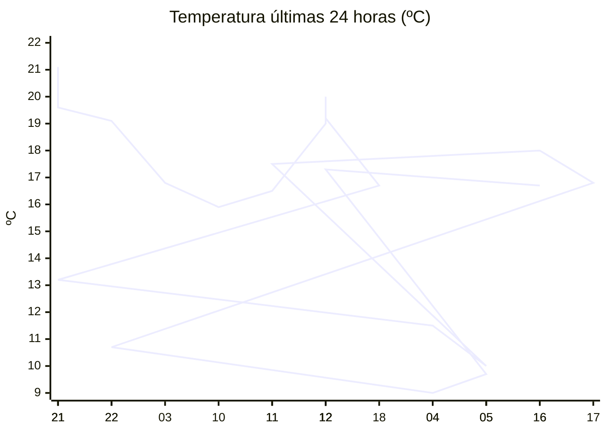

# rem-scrap

Actualización automática del clima para la estación Concarán.

## Últimos datos

| Campo | Valor |
| --- | --- |
| Estación | Concarán |
| Hora | 16:23 |
| Temperatura | 16,7 ºC |
| Humedad | 77,2 % |
| Lluvia (1h) | 9,2 mm |
| Lluvia (24h) | 12,0 mm |
| Lluvia (30d) | 44,6 mm |
| Lluvia (Año) | 529,6 mm |
| Rad. Solar | 233,0 W/m2 |
| Temp Max Hoy | 19 ºC a las 13:05 |
| Temp Min Hoy | 9 ºC a las 04:29 |
| VPS (VPD) | 0.43 kPa (bajo) |

## Resumen IA

Estación Concarán, 16:23 – tarde fresca y húmeda, con reciente chaparrón.  

Temperatura: la lectura actual es 16,7 ºC, dentro del rango térmico del día (9 ºC‑19 ºC, 10 ºC de amplitud). Está a 2,3 ºC de la máxima y a 7,7 ºC de la mínima, por lo que se acerca más al extremo cálido del día.  

Humedad y vapor: la humedad relativa es 77,2 % y el VPD es 0,43 kPa, valor bajo (<0,8 kPa). El aire tiene poca demanda de vapor, la transpiración de los cultivos será baja y el riesgo de desarrollo de hongos aumenta por la humedad estancada.  

Lluvia y radiación: en la última hora cayó 9,2 mm y en 24 h se acumuló 12,0 mm, lo que mantiene el suelo húmedo y eleva la humedad ambiental. La radiación solar de 233 W/m² a esta hora indica una luz moderada, suficiente para fotosíntesis pero sin intensas radiaciones de pico.  

Recomendación: vigile la aparición de enfermedades foliares y, si es necesario, aumente la ventilación o aplique fungicidas preventivos.

## Tendencia últimas 24 h

## Fuente

Datos extraídos de [clima.sanluis.gob.ar](https://clima.sanluis.gob.ar/Estacion.aspx?estacion=8).

## Generado automáticamente

Este archivo fue actualizado el 9 de octubre de 2026 a las 07:24:09.
