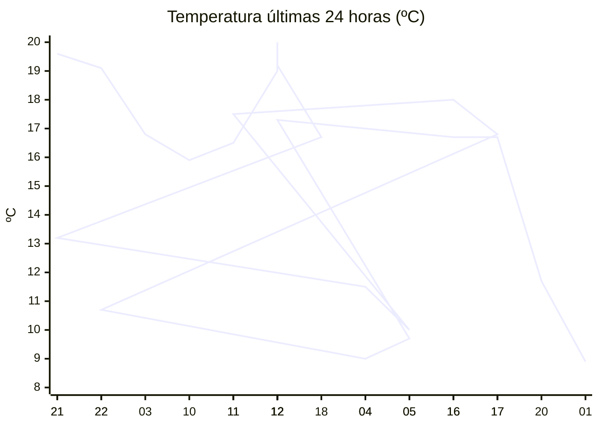

# rem-scrap

Actualización automática del clima para la estación Concarán.

## Últimos datos

| Campo | Valor |
| --- | --- |
| Estación | Concarán |
| Hora | 01:50 |
| Temperatura | 8,9 ºC |
| Humedad | 97,3 % |
| Lluvia (1h) | 0,0 mm |
| Lluvia (24h) | 12,0 mm |
| Lluvia (30d) | 35,9 mm |
| Lluvia (Año) | 529,6 mm |
| Rad. Solar | 0,0 W/m2 |
| Temp Max Hoy | 10 ºC a las 00:23 |
| Temp Min Hoy | 10 ºC a las 00:00 |
| VPS (VPD) | 0.03 kPa (bajo) |

## Resumen IA

Estación Concarán, 01:50 h – noche fresca y muy húmeda, con cielo nublado y sin sol.  

Temperatura actual 8,9 ºC, ligeramente por debajo de la máxima y mínima registradas hoy (10 ºC). El rango térmico del día fue prácticamente plano (10 – 10 ºC), y la temperatura actual se encuentra a 1,1 ºC del extremo inferior, indicando que el aire se ha enfriado ligeramente después del pico de la madrugada.  

Humedad relativa 97,3 % y VPD 0,03 kPa, valor muy bajo (por debajo de 0,8 kPa). El aire está poco demandante, la transpiración de las plantas será mínima y el exceso de humedad favorece la proliferación de hongos si el follaje permanece mojado.  

Lluvia en la última hora 0,0 mm, pero 12,0 mm en las últimas 24 h, lo que mantiene el suelo húmedo y refuerza la alta humedad del aire. Radiación solar 0 W/m2, acorde a la hora nocturna, sin aporte de energía solar.  

Recomendación: mantenga buena ventilación nocturna y evite el riego hasta que el VPD suba y la humedad disminuya, para prevenir problemas fúngicos.

## Tendencia últimas 24 h

## Fuente

Datos extraídos de [clima.sanluis.gob.ar](https://clima.sanluis.gob.ar/Estacion.aspx?estacion=8).

## Generado automáticamente

Este archivo fue actualizado el 10 de octubre de 2026 a las 04:51:39.
