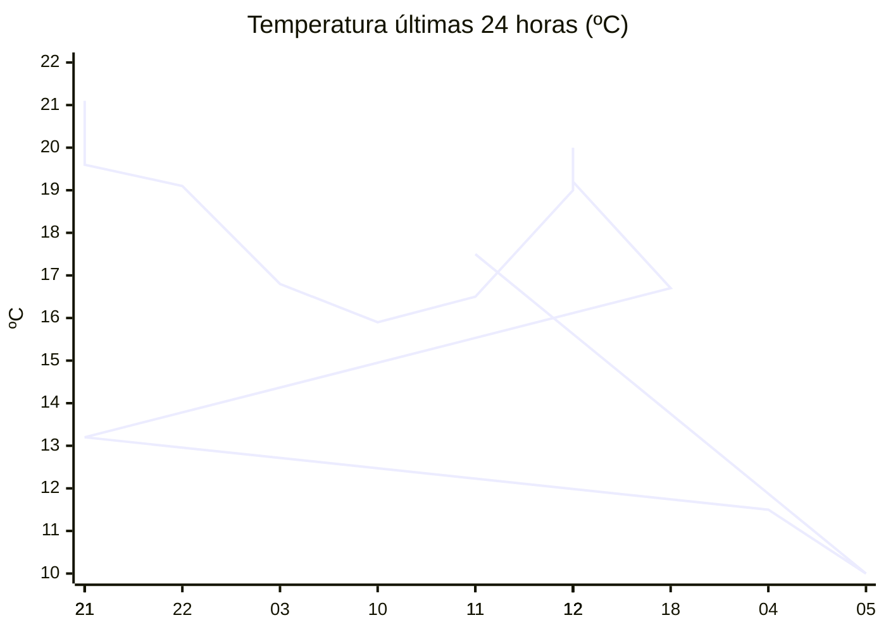

# rem-scrap

Actualización automática del clima para la estación Concarán.

## Últimos datos

| Campo | Valor |
| --- | --- |
| Estación | Concarán |
| Hora | 11:31 |
| Temperatura | 17,5 ºC |
| Humedad | 55,4 % |
| Lluvia (1h) | 0,0 mm |
| Lluvia (24h) | 0,0 mm |
| Lluvia (30d) | 33,0 mm |
| Lluvia (Año) | 517,6 mm |
| Rad. Solar | 691,0 W/m2 |
| Temp Max Hoy | 17 ºC a las 10:59 |
| Temp Min Hoy | 10 ºC a las 05:34 |
| VPS (VPD) | 0.89 kPa (ideal) |

## Resumen IA

Estación Concarán, 11:31 h – el clima se presenta templado y bastante soleado. La temperatura actual es de 17,5 ºC, apenas 0,5 ºC por encima de la máxima registrada del día (17 ºC) y muy cerca del límite superior del rango térmico del día (máx 17 – mín 10 = 7 ºC). La sensación térmica está dominada por el sol y no se percibe frío nocturno. La humedad relativa está en 55,4 % y el VPD es 0,89 kPa, valor catalogado como ideal para el desarrollo vegetativo: el aire no está demasiado seco ni demasiado húmedo, lo que permite una transpiración equilibrada y reduce el riesgo de enfermedades fúngicas. No hubo precipitación en la última hora ni en las últimas 24 h (0 mm), aunque el acumulado mensual alcanza 33 mm y el anual 517,6 mm, lo que mantiene el suelo con humedad moderada. La radiación solar de 691 W/m2 a media mañana indica una intensidad solar fuerte, adecuada para cultivos que requieran buena luz. Recomendación: mantener riego ligero y observar la humedad del sustrato para evitar sobre‑riego bajo estas condiciones óptimas de VPD y alta radiación.

## Tendencia últimas 24 h

## Fuente

Datos extraídos de [clima.sanluis.gob.ar](https://clima.sanluis.gob.ar/Estacion.aspx?estacion=8).

## Generado automáticamente

Este archivo fue actualizado el 8 de octubre de 2026 a las 02:32:13.
