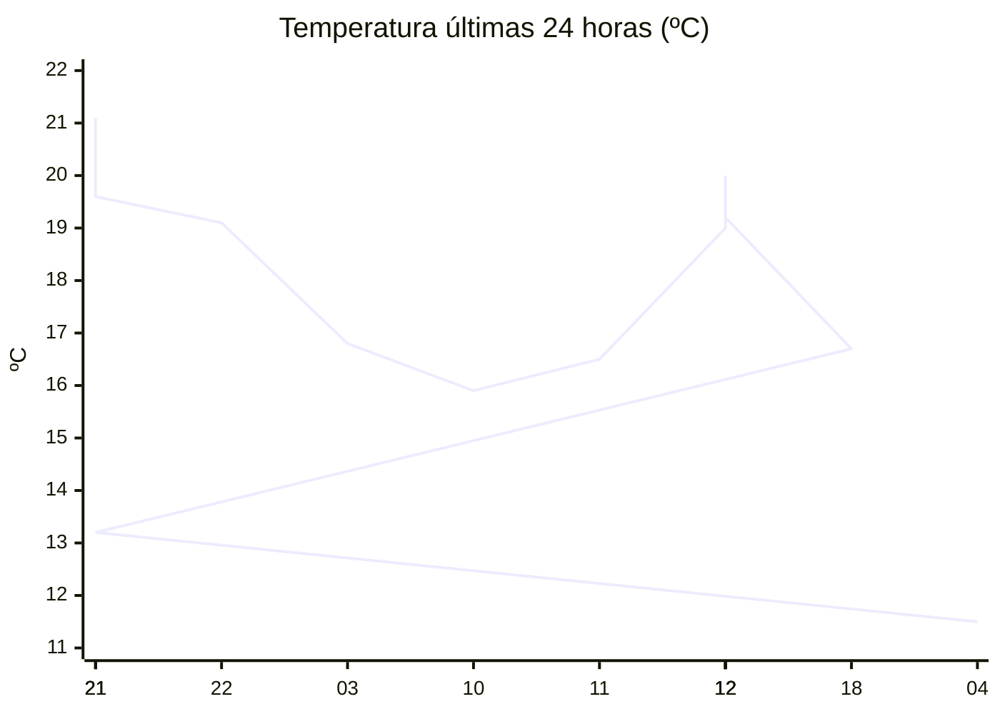

# rem-scrap

Actualización automática del clima para la estación Concarán.

## Últimos datos

| Campo | Valor |
| --- | --- |
| Estación | Concarán |
| Hora | 04:03 |
| Temperatura | 11,5 ºC |
| Humedad | 89,6 % |
| Lluvia (1h) | 0,0 mm |
| Lluvia (24h) | 0,0 mm |
| Lluvia (30d) | 33,0 mm |
| Lluvia (Año) | 517,6 mm |
| Rad. Solar | 0,0 W/m2 |
| Temp Max Hoy | 13 ºC a las 00:02 |
| Temp Min Hoy | 11 ºC a las 01:58 |
| VPS (VPD) | 0.14 kPa (bajo) |

## Resumen IA

Estación Concarán, 04:03 hs: madrugada fresca y muy húmeda.  
Temperatura actual 11,5 ºC frente a la máxima de 13 ºC y la mínima de 11 ºC; el rango térmico del día es de 2 ºC y el valor presente se sitúa a 0,5 ºC de la mínima y a 1,5 ºC de la máxima, por lo que está más próximo al extremo frío.  
Humedad relativa 89,6 % y VPD 0,14 kPa: el VPD está muy por debajo del umbral de 0,8 kPa, lo que indica aire poco demandante, transpiración reducida y un riesgo elevado de desarrollo de hongos si la humedad persiste.  
No se registró lluvia en la última hora ni en las últimas 24 h; la radiación solar es 0 W/m2, típica de la hora nocturna, por lo que no hay aporte solar que modere la humedad.  
Recomendación: mantenga una ventilación ligera para reducir la humedad estancada y evite riegos nocturnos intensos hasta que disminuya la humedad del aire.

## Tendencia últimas 24 h

## Fuente

Datos extraídos de [clima.sanluis.gob.ar](https://clima.sanluis.gob.ar/Estacion.aspx?estacion=8).

## Generado automáticamente

Este archivo fue actualizado el 8 de octubre de 2026 a las 07:04:30.
