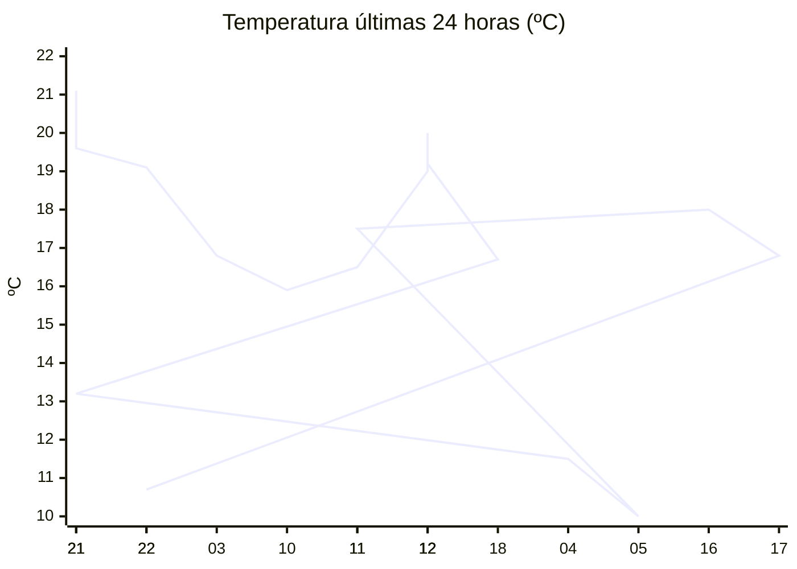

# rem-scrap

Actualización automática del clima para la estación Concarán.

## Últimos datos

| Campo | Valor |
| --- | --- |
| Estación | Concarán |
| Hora | 22:01 |
| Temperatura | 10,7 ºC |
| Humedad | 91,4 % |
| Lluvia (1h) | 0,0 mm |
| Lluvia (24h) | 0,0 mm |
| Lluvia (30d) | 33,0 mm |
| Lluvia (Año) | 517,6 mm |
| Rad. Solar | 0,0 W/m2 |
| Temp Max Hoy | 20 ºC a las 14:20 |
| Temp Min Hoy | 10 ºC a las 05:34 |
| VPS (VPD) | 0.11 kPa (bajo) |

## Resumen IA

Estación Concarán, 22:01 h – noche fresca y muy húmeda.  
Temperatura actual 10,7 ºC se sitúa cerca del mínimo del día (10 ºC) y distante 9,3 ºC de la máxima (20 ºC). El rango térmico del día es de 10 ºC; el valor presente está apenas 0,7 ºC por encima del mínimo, por lo que el ambiente se siente más cercano al frío matutino que al calor vespertino.  
Humedad relativa 91,4 % y VPD 0,11 kPa indican un aire poco demandante de agua; la transpiración de las plantas será muy baja y el riesgo de desarrollo de hongos aumenta por la humedad estancada.  
No se registró precipitación en la última hora ni en las últimas 24 h, aunque el acumulado mensual es de 33,0 mm y el anual 517,6 mm. La radiación solar es nula, correspondiente a la hora nocturna, por lo que no hay aporte solar directo.  
Recomendación: mantenga una buena ventilación nocturna y evite riegos excesivos para prevenir problemas de hongos.

## Tendencia últimas 24 h

## Fuente

Datos extraídos de [clima.sanluis.gob.ar](https://clima.sanluis.gob.ar/Estacion.aspx?estacion=8).

## Generado automáticamente

Este archivo fue actualizado el 9 de octubre de 2026 a las 01:02:19.
