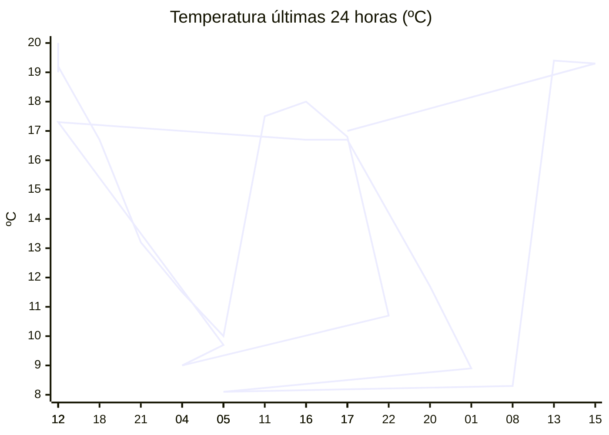

# rem-scrap

Actualización automática del clima para la estación Concarán.

## Últimos datos

| Campo | Valor |
| --- | --- |
| Estación | Concarán |
| Hora | 17:30 |
| Temperatura | 17,0 ºC |
| Humedad | 57,9 % |
| Lluvia (1h) | 0,0 mm |
| Lluvia (24h) | 4,6 mm |
| Lluvia (30d) | 40,5 mm |
| Lluvia (Año) | 534,2 mm |
| Rad. Solar | 64,0 W/m2 |
| Temp Max Hoy | 21 ºC a las 14:51 |
| Temp Min Hoy | 8 ºC a las 06:57 |
| VPS (VPD) | 0.82 kPa (ideal) |

## Resumen IA

Concarán, 17:30 – tarde fresca y ligeramente húmeda. La temperatura actual es 17,0 ºC, dentro de un rango térmico del día de 13 ºC (máx 21 ºC a las 14:51 y mín 8 ºC a las 06:57). El valor está a 4 ºC de la máxima y 9 ºC de la mínima, por lo que se aproxima más al extremo cálido del día. La humedad relativa se registra en 57,9 % y el VPD es 0,82 kPa, lo que se considera ideal para la fase vegetativa: el aire no es demasiado demandante y la transpiración de las plantas será eficiente, sin riesgo elevado de estrés hídrico ni de desarrollo de hongos por saturación. En la última hora no hubo precipitación, pero en las últimas 24 h cayeron 4,6 mm, lo que eleva la humedad del suelo y del aire. La radiación solar de 64,0 W/m² a esta hora indica luz moderada, típica de la tarde. Recomiendo mantener riegos moderados y vigilar la humedad del sustrato para evitar encharcamientos.

## Tendencia últimas 24 h

## Fuente

Datos extraídos de [clima.sanluis.gob.ar](https://clima.sanluis.gob.ar/Estacion.aspx?estacion=8).

## Generado automáticamente

Este archivo fue actualizado el 10 de octubre de 2026 a las 08:31:08.
