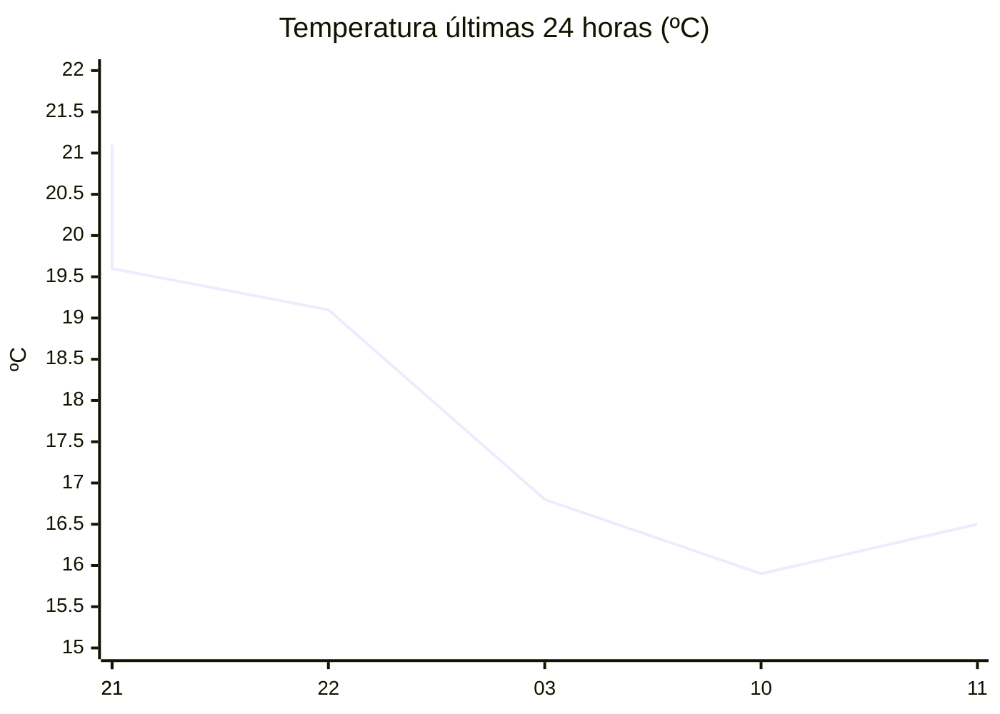

# rem-scrap

Actualización automática del clima para la estación Concarán.

## Últimos datos

| Campo | Valor |
| --- | --- |
| Estación | Concarán |
| Hora | 11:02 |
| Temperatura | 16,5 ºC |
| Humedad | 85,8 % |
| Lluvia (1h) | 0,0 mm |
| Lluvia (24h) | 0,0 mm |
| Lluvia (30d) | 33,0 mm |
| Lluvia (Año) | 517,6 mm |
| Rad. Solar | 117,0 W/m2 |
| Temp Max Hoy | 17 ºC a las 02:47 |
| Temp Min Hoy | 15 ºC a las 00:31 |
| VPS (VPD) | 0.27 kPa (bajo) |

## Resumen IA

Estación Concarán, 11:02 h – la mañana se presenta fresca y bastante húmeda.  
Temperatura actual 16,5 ºC, con una máxima del día de 17 ºC y una mínima de 15 ºC, lo que da un rango térmico de 2 ºC. El valor observado está 0,5 ºC por debajo del máximo y 1,5 ºC por encima del mínimo, acercándose más al extremo caliente del día.  
La humedad relativa es del 85,8 % y el VPD registrado es 0,27 kPa, un valor bajo (menor a 0,8 kPa). Esto indica que el aire tiene poca demanda de agua, favoreciendo una transpiración reducida y aumentando el riesgo de desarrollo de hongos por la humedad estancada.  
No se registró lluvia en la última hora ni en las últimas 24 h; la precipitación acumulada en los últimos 30 d es de 33,0 mm y en el año 517,6 mm, de modo que la humedad del ambiente proviene del vapor atmosférico y no de precipitaciones recientes. La radiación solar a esta hora es de 117,0 W/m², lo que corresponde a una intensidad solar moderada.  
Recomendación: aumente la ventilación del cultivo o del invernadero para reducir la humedad y prevenir problemas fúngicos.

## Tendencia últimas 24 h

## Fuente

Datos extraídos de [clima.sanluis.gob.ar](https://clima.sanluis.gob.ar/Estacion.aspx?estacion=8).

## Generado automáticamente

Este archivo fue actualizado el 7 de octubre de 2026 a las 02:03:05.
